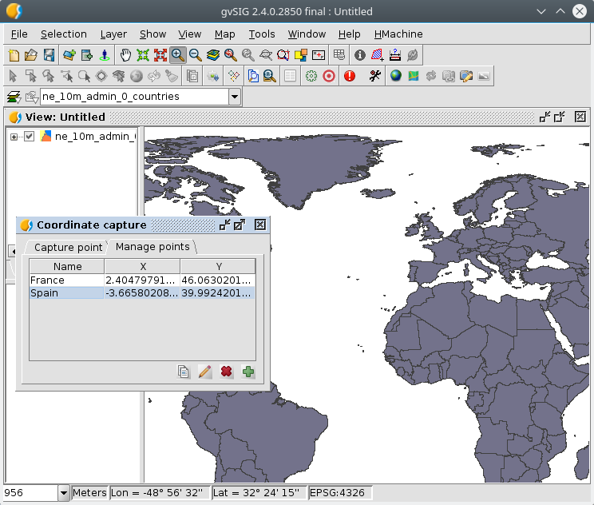

 
Coordinate capture
====================

This utility allows you to capture the coordinates of a point of the *View*
to be able to *paste them to the clipboard*.

It also allows you to assign a name and save those coordinates for your
porterior use in other parts of gvSIG (this requires gvSIG 2.4.1 or higher).

Optionally allows to select a *Coordinate Reference System* (*CRS*) other than
of *View* to present those coordinates in that other *CRS*.

Once the points are captured we can save them for later use in other parts of the application.

